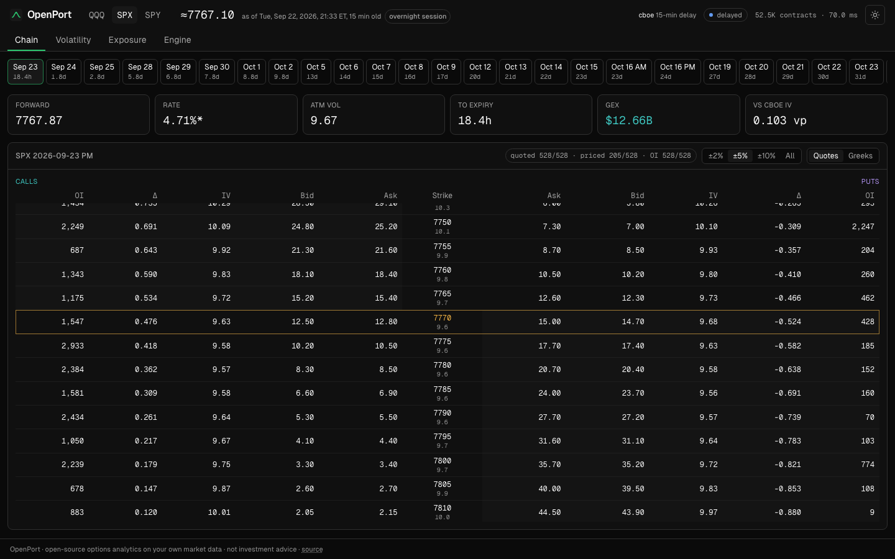
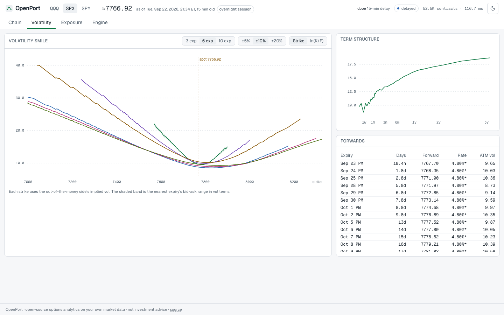
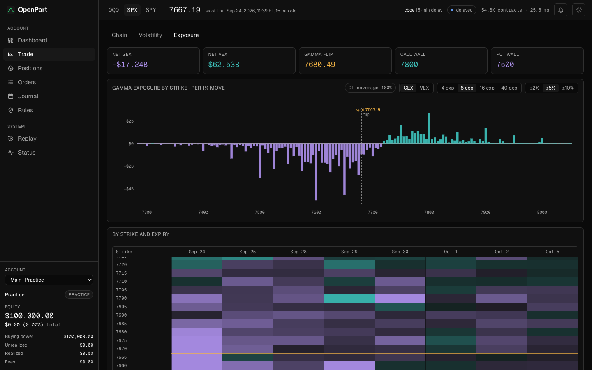

# OpenPort

Self-hosted options analytics and a trading simulator on your own market data. Plug in
the provider you already pay for, or start with Cboe's free delayed quotes, and get a
live web terminal: option chains with implied volatility and Greeks computed by OpenPort
itself, smiles and term structure, gamma and vanna exposure maps, and a paper account
that trades those chains under prop-firm evaluation rules.

One C++20 binary runs the feed, the analytics engine, the simulator and the web
terminal. Your API keys, your data and your trades stay on your machine.



| Volatility (light theme) | Exposure |
| --- | --- |
|  |  |

## What you get

- **Chain**: bid, ask and mid with bid/mid/ask IV, delta, gamma, vega, theta, vanna and
  open interest per strike, centred on the money, with the provider's own IV alongside
  where it publishes one. SPX (AM-settled) and SPXW (PM-settled) expiring on the same
  day stay separate. Missing quotes and open interest show as missing, never as zero,
  with coverage counts per expiry.
- **Smile and term structure**: out-of-the-money smile per expiry with its SVI fit and
  arbitrage checks, and the ATM term structure on a square-root-of-time axis, with each
  expiry's forward and rate and where it came from.
- **Exposure**: GEX and VEX by strike and expiry, total gamma profile, gamma flip, and
  call and put walls.
- **Evaluation simulator**: trade index options against live quotes under funded-account
  style rules: a profit target and a trailing drawdown floor (intraday or end of day)
  decide pass or fail, with buy-only and buying-power plans and auto-close before
  expiry. Orders can wait for the underlying to cross a level, and brackets attach a
  stop-loss and take-profit (on the option or the underlying) that cancel each other.
  Strategies of up to four legs (spreads, straddles, condors, butterflies, calendars and
  diagonals) are picked on the chain and fill together at a net debit or credit, with
  their payoff at expiry, and buying power nets them: a credit spread holds its width
  and a calendar its debit, not a naked requirement. Working orders change in place
  (size, limit or trigger), and positions close together as one order, or all at once
  with a flatten that buys shorts back first.
  The Dashboard charts equity against the target and floor; Trade charts the underlying
  (one-minute to daily candles, backfilled from Cboe's free history) with your strikes,
  armed triggers and the selected expiry's expected move on it, and docks an order ticket
  beside the chain; Positions adds Greeks, limits, a spot × vol scenario grid and a
  kill switch; Orders, a Journal (P&L calendar, win rate, profit factor, reports by hold
  time, weekday and month) and Rules complete the account.
- **Record and replay**: save any provider's feed to a file and play it back later with
  its original market times, for demos at night and reproducible bug reports.
- **Engine**: feed health per underlying, trading session, queue and analytics timing.
- Light and dark themes, keyboard shortcuts (number keys switch pages, arrows step
  expiries).

## Paper trading

The engine simulates orders on European cash-settled index options (SPX, XSP, NDX,
RUT and their weeklies) and American equity and ETF options (SPY, QQQ, single stocks)
against displayed quotes: market and marketable orders take the
far side up to the displayed size, resting limits fill when a later quote crosses them,
and every fill pays a per-contract fee. Positions are marked at the mid, and risk
limits on dollar delta, vega, order size, price bands and daily loss are checked before
and at every fill, with a kill switch that stays tripped until reset. Orders are
accepted during the product's regular session only (09:30 to 16:15 ET for index
options). The account survives restarts through an append-only, hash-chained journal at
`$HOME/.openport/paper-journal.jsonl`; use `--no-paper` to disable trading. American
options are simulated without early exercise, assignment or stock positions: one held
into expiry settles in cash at intrinsic value. Portfolio margin and brokerage
execution are out of scope.

Buying power follows each order's real margin: a naked short holds the usual
20%-of-spot requirement, while spreads, condors, butterflies, calendars and diagonals
hold only what they can lose. An order that would use buying power must fit within it;
anything that frees buying power (closing, buying back a short, buying protection) is
always allowed, even when the account is short of it.

`--plan` chooses the rules for a new journal: `practice` (the default: buying power
only), `intraday-25k|50k|100k` (buy-only, 10% target, 5% drawdown trailing every new
high) or `eod-25k|50k|100k` (any strategy, 12% target, 6% drawdown trailing each close).
Touching the floor fails the attempt and closes every position; reaching the target
passes it. Start a new attempt with any plan from the Dashboard or Rules page; history
is kept across attempts.

The engine also models the funded phase that follows a pass (`funded-*` plans with a
locking floor and payouts; see [Paper trading](docs/paper-trading.md)). This is a
simulator that funds no one, so the web terminal hides those plans and the Payouts page;
set `showFundedAccounts` in `web/src/lib/features.ts` to offer them.

Loopback writes are open unless a token is configured. To enable writes on a
remote bind, set `OPENPORT_WRITE_TOKEN` or `--write-token TOKEN` and send it as a
Bearer token over HTTPS. Use `--allowed-origin https://your-terminal.example` for
a proxy that changes Host. Docker stores the journal in the `/var/lib/openport`
volume. See [Paper trading](docs/paper-trading.md) for the HTTP contract, settlement
sources and simulation limitations.

## Quick start

With Docker (Cboe delayed SPX, SPY and QQQ, no key needed):

```bash
docker build -t openport .
docker run --rm -p 127.0.0.1:8080:8080 openport
```

Then open http://localhost:8080. To use your own provider, pass its key and arguments:

```bash
docker run --rm -p 127.0.0.1:8080:8080 -e DATABENTO_API_KEY openport --provider databento --symbols SPX,QQQ
```

From source (CMake 3.25+, a C++20 compiler, Boost 1.83+, OpenSSL 3, zlib, zstd and
Node 22+; everything else is fetched and pinned by checksum):

```bash
cmake -S . -B build -DCMAKE_BUILD_TYPE=Release
cmake --build build -j
(cd web && npm ci && npm run build)
./build/apps/openportd --symbols SPX,SPY,QQQ --web-root web/dist
```

## Providers

| Provider | `--provider` | Data | Key |
| --- | --- | --- | --- |
| Cboe delayed | `cboe` (default) | 15-minute delayed chain snapshots for US index and equity options, with open interest and Cboe's Greeks, polled every 15 s | none |
| Databento | `databento` | Real-time OPRA consolidated quotes (`cbbo-1s` or `cmbp-1`), trades and open interest, streamed | `DATABENTO_API_KEY` |
| Massive | `massive` | Option chain snapshots, real-time or delayed depending on your plan, polled every 5 s | `MASSIVE_API_KEY` |
| ThetaData | `thetadata` | Snapshots from your local Theta Terminal (v3), polled every 2 s | Theta Terminal login |
| Replay | `replay` | A file written with `--record`, played back at 1×, 10×, 60× or full speed (`--option file=PATH --option speed=10`) | none |

Providers deliver very different things: Databento sends raw exchange quotes with no
Greeks and no underlying price, while others ship their own Greeks. OpenPort normalises
all of them into the same contracts, quotes and open interest, then computes everything
itself, so the numbers mean the same thing whichever provider you use.

Common flags: `--symbols SPX,SPY`, `--expiries N` (nearest N expiries), `--window F`
(strikes within ±F of spot), `--poll-seconds N`, `--rate R` (the assumed rate when no
index curve is available), `--address`, `--port`, `--web-root`, `--allowed-origin`,
`--record FILE`, `--paper-journal`, `--plan`, `--paper-cash`, `--paper-fee`, `--no-paper`,
`--write-token`, `--candle-dir DIR` and `--no-history` (see
[price history](docs/runtime.md#price-history)), and
`--option KEY=VALUE` for provider settings such as `quotes=cmbp-1` for Databento. Every
value is range-checked; see the [runtime notes](docs/runtime.md) for details.

## How the numbers are made

- **Time to expiry** runs from the data's own market time, not the wall clock, to the
  settlement instant: 09:30 ET for AM-settled, 16:00 ET for PM-settled, 13:00 ET on
  early-close days, from a holiday and early-close calendar. Each product knows its
  sessions, including Cboe's overnight session for SPX, XSP, VIX and RUT options, so a
  delayed snapshot taken after the close keeps the closing time while one taken
  overnight uses the overnight quotes' time.
- **Spot** is the provider's underlying price while it is current. When there is none
  (Databento) or it is more than 30 minutes behind the options (the SPX index is frozen
  overnight while its options trade), spot is inferred from put-call parity and shown
  with ≈.
- **Forward and discount factor** come from a weighted put-call parity fit over the
  strikes nearest the money, per expiry, with capped weights and median-based outlier
  rejection so one bad quote cannot move it. No dividend or borrow assumptions are
  needed. Expiries under 30 days borrow the median rate of the longer ones: over a few
  days the discount factor is within a basis point of 1, so bid/ask noise swamps the
  slope.
- **Implied volatility** is Black-76 on that forward: Newton's method in log-price space
  from a Corrado-Miller initial guess, with a bisection safeguard. About 0.5 µs and 5.4
  iterations per option. Each strike's smile IV comes from its out-of-the-money side,
  and both sides' Greeks use it.
- **SVI surfaces** fit each expiry's OTM total variance with deterministic, constrained
  quasi-explicit calibration and capped bid/ask IV weights. Fits run lazily in the
  API, cached per analytics snapshot; butterfly and calendar grid violations remain
  visible alongside market points. [Model, checks and timings](docs/svi.md).
- **American-style** equity and ETF options cannot fit a rate from their own parity:
  early exercise makes puts worth more at higher strikes, which reads as rates between
  -3% and +2% for SPY and QQQ. They take the zero-rate curve fitted on a European index
  (SPX when subscribed) or the flat `--rate`. Each option's early-exercise premium,
  American minus European value on the same Leisen-Reimer tree, is removed before the
  forward and IVs are fitted; displayed quotes stay as quoted.
  [Accuracy and cost](docs/american-analytics.md).
- **Greeks**: delta and gamma with respect to spot, vega per vol point, and theta per
  calendar day with the forward held fixed, which is how Cboe quotes it. For American
  options they are European Greeks at the de-Americanised IV, accurate out of the money.
- **Exposure** uses the common open-interest convention: dealers are assumed long the
  calls and short the puts customers hold. That is a modelling convention, not knowledge
  of anyone's positions. GEX per strike is gamma × OI × multiplier × S² × 1%, dollars of
  hedging per 1% move; VEX is vanna × OI × multiplier × S per vol point. Exposure uses at
  least half a day to expiry so the local gamma of an option minutes from expiry does not
  drown out everything else. The gamma flip is where total GEX changes sign, found by
  bisection over the same positions as the total.

Checked against Cboe's own published IVs on 2026-09-22 after the close: across every
expiry, the median difference on out-of-the-money options within 10% of the forward is
0.009 vol points for SPX, 0.025 for QQQ and 0.037 for SPY. Theta matches Cboe's within
about 1.3%.

## Performance

On an Apple M2 Max, a full analytics pass over the SPX chain (29,942 options across 62
expiries) takes about 55 ms, and SPY with de-Americanisation (12,066 options across 31
expiries) about 33 ms. The engine recomputes at most once a second, and only for
underlyings whose data or rate curve changed; each pass publishes an immutable snapshot,
so HTTP readers never block the feed. While the engine is busy, the queue from the
providers keeps only the latest quote per contract.

```
provider thread ──events──▶ queue ──▶ engine thread: chain book ──▶ analytics
                                                                        │
                        web terminal ◀── JSON API + WebSocket ticks ◀── immutable snapshot
```

## API

| Route | Returns |
| --- | --- |
| `GET /api/status` | Provider, market and per-underlying sessions, feed health, engine counters |
| `GET /api/underlyings/{symbol}/summary` | Spot and its source, expiries with forward, rate and its source, ATM IV, GEX, VEX and coverage |
| `GET /api/underlyings/{symbol}/chain?expiry={id}` | Every strike with both sides' quotes, IV, Greeks and early-exercise premium |
| `GET /api/underlyings/{symbol}/exposure?expiries=8` | GEX and VEX by strike and expiry, flip and walls |
| `GET /api/underlyings/{symbol}/surface?expiries=12` | Smile points per expiry |
| `GET /api/underlyings/{symbol}/candles?interval=5m` | OHLC bars at 1m, 5m, 15m, 30m, 1h or 1d, oldest first |
| `WS /ws` | A small tick each second with versions, so clients refetch only what changed |

Expiry ids are the date plus settlement, for example `2026-10-16AM`.

With paper trading on, the same API is the account: `GET /api/portfolio`, `/api/orders`,
`/api/fills`, `/api/risk`, `/api/account`, `/api/trades` and `/api/plans`, and writes
with `POST /api/orders`, `PUT` and `DELETE /api/orders/{id}` (change or cancel),
`POST /api/orders/cancel` and `POST /api/positions/close` (cancel all, flatten),
`PUT /api/risk/limits`, `POST /api/risk/kill` and `POST /api/account/reset`. The web terminal uses exactly
these routes, so anything it does can be scripted. An order takes one contract, or
`legs` for a strategy; this calendar buys the later put and sells the nearer one at a
net debit of at most 6.60:

```bash
curl -X POST localhost:8080/api/orders -H 'Content-Type: application/json' -d '{
  "client_order_id": "calendar-1", "type": "limit", "quantity": 1,
  "limit_price": "6.60", "time_in_force": "day",
  "legs": [{"symbol": "SPXW  260925P07700000", "side": "buy"},
           {"symbol": "SPXW  260923P07700000", "side": "sell"}]}'
```

[Paper trading](docs/paper-trading.md) documents every field, rule and reason code.

## Security

openportd binds to 127.0.0.1 by default and has no authentication. If you expose it,
put it behind a reverse proxy that authenticates. Static files are confined to the web
root, and WebSocket upgrades must come from the same origin; behind a proxy that
rewrites the Host header, list your public origin with `--allowed-origin`. Check your
data provider's terms before sharing an instance with anyone else.

## Development

```bash
./build/tests/openport_tests        # C++ unit tests
./build/bench/openport_bench        # pricing benchmarks
cd web && npm run dev               # Vite on :5173, proxying /api and /ws to :8080
cd web && npx vitest run            # web unit tests
```

The C++ suite passes with Apple Clang on macOS and with GCC 13 on Ubuntu 24.04 built
with `-DOPENPORT_WERROR=ON`.

## Roadmap

- [x] Pricing core: Black-76 and Black-Scholes-Merton with full Greeks, safeguarded IV
      solver, Cox-Ross-Rubinstein and Leisen-Reimer trees
- [x] Providers: Cboe, Databento, Massive and ThetaData
- [x] Chain analytics: parity forwards, IV and Greeks, smiles, GEX and VEX
- [x] Web terminal
- [x] De-Americanised implied volatility for equity options
- [x] SVI volatility surface
- [x] Record and replay of any provider's feed
- [x] Paper trading and risk: fills against live quotes, Greeks limits, scenarios
- [x] Evaluation simulator: profit targets, trailing drawdowns, resets, trade journal
- [x] Funded phase in the engine: locking drawdown floors, qualifying days and payouts
- [x] Multi-leg orders (spreads, condors, calendars) with spread-aware buying power
- [x] Paper trading for American equity and ETF options (cash settlement at intrinsic)
- [x] Underlying chart with positions, triggers and the expected move
- [ ] Stock positions, early exercise and assignment
- [ ] Paper trading in Cboe's overnight session
- [ ] P&L attribution by delta, gamma, vega and theta

## License

MIT. Not investment advice.
