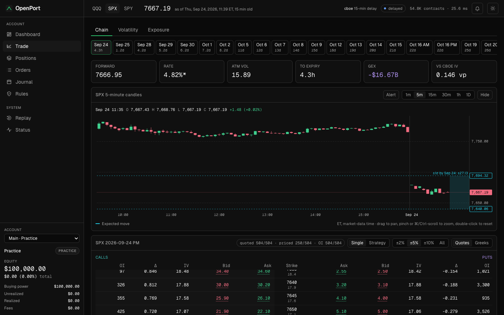
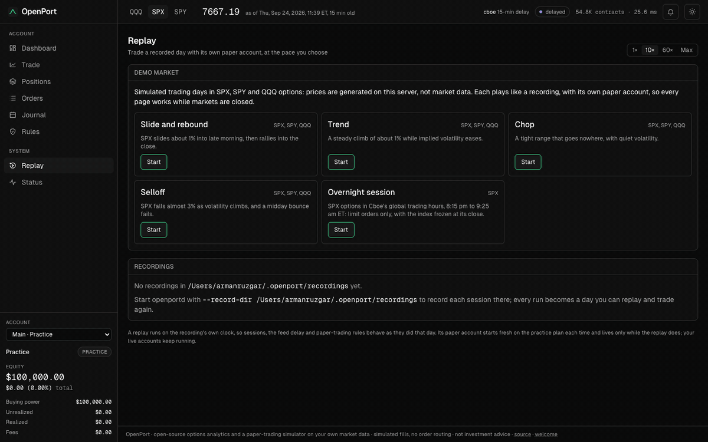

# OpenPort

[](https://github.com/38st/openport/actions/workflows/ci.yml)

Self-hosted options analytics and a trading simulator on your own market data. Plug in
the provider you already pay for, or start with Cboe's free delayed quotes, and get a
live web terminal: option chains with implied volatility and Greeks computed by OpenPort
itself, smiles and term structure, gamma and vanna exposure maps, and paper accounts
that trade those chains under prop-firm evaluation rules, with multi-leg strategies, a
chart of the underlying and replays of recorded days.

One C++20 binary runs the feed, the analytics engine, the simulator and the web
terminal. Your API keys, your data and your trades stay on your machine.



| Volatility (light theme) | Exposure |
| --- | --- |
|  |  |

## At a glance

- **One C++20 process** runs the feed, the analytics engine, the simulator and the web
  server; the terminal is React and TypeScript. [Architecture](docs/architecture.md).
- **Implied volatility** in about 0.4 µs and 5.4 Newton iterations per option, and a
  full analytics pass over the SPX chain (30,182 options, 63 expiries) in about 40 ms.
- **Within a few hundredths of a vol point** of Cboe's published IVs: median
  differences of 0.012 (SPX), 0.030 (QQQ) and 0.028 (SPY) out of the money.
- **A prop-firm-style simulator**: orders fill against the quotes the feed displays,
  under evaluation rules, with a hash-chained journal that survives restarts.
- **528 C++ and 294 web tests**, built in CI with GCC 13 on Ubuntu and Apple Clang on
  macOS, warnings as errors.

Timings are medians on an Apple M2 Max: the IV solve from `openport_bench`, and the SPX
pass (over 23 passes) and the Cboe comparison on live data during the session, all on
2026-09-24.

No market open, or no data? The **demo market** plays simulated trading days you can
trade (a reversal, a trend, a chop, a selloff and an overnight session in SPX, SPY and
QQQ options), with generated prices labelled as simulated on every page:



## What you get

### Market analytics

- **Chain**: bid, ask and mid with bid/mid/ask IV, delta, gamma, vega, theta, vanna and
  open interest per strike, centred on the money, with the provider's own IV alongside
  where it publishes one. SPX (AM-settled) and SPXW (PM-settled) expiring on the same
  day stay separate. Missing quotes and open interest show as missing, never as zero,
  with coverage counts per expiry.
- **Smile and term structure**: out-of-the-money smile per expiry with its SVI fit and
  arbitrage checks, and the ATM term structure on a square-root-of-time axis, with each
  expiry's forward and rate and where it came from.
- **Exposure**: GEX and VEX by strike and expiry, total gamma profile, gamma flip, and
  call and put walls.

### Trading terminal

- **Trade**: the chain with an order ticket docked beside it, and a candle chart of the
  underlying (one-minute to daily, backfilled from Cboe's free history) showing your
  strikes, armed triggers and the selected expiry's expected move.
- **Orders**: limit and market orders, orders that wait for the underlying to cross a
  level, and brackets whose stop-loss and take-profit (on the option or the underlying)
  cancel each other. Working orders change in place: size, limit or trigger level.
- **Strategies**: up to four legs (spreads, straddles, condors, butterflies, calendars
  and diagonals) picked on the chain and filled together at a net debit or credit. The
  ticket shows the P&L at expiry and today, the probability of profit and the expected
  move. A held strategy is one row with its net P&L and Greeks, closed or rolled to a
  later expiry in one order.
- **Evaluations**: a profit target and a trailing drawdown floor (intraday or end of day)
  decide pass or fail, with buy-only, defined-risk and buying-power rules and auto-close
  before expiry.
  The Dashboard charts equity against the target and floor, and the Journal keeps a P&L
  calendar, win rate, profit factor and reports by hold time, weekday, month and tag,
  per contract or per strategy, with shares from exercise and assignment as trades of
  their own. Each trade takes a note and tags, kept in the account's journal. A new
  attempt keeps the history.
- **Risk**: Greeks per position, today's P&L split by delta, gamma, vega and theta
  (with costs apart), dollar-delta and vega limits, a spot × volatility scenario grid,
  a daily loss limit and a kill switch. Positions close together as one
  order, or flatten an underlying or the whole account in one step.
- **Accounts**: several named accounts at once, say a 50K evaluation beside a practice
  book, each with its own journal, rules and positions on the same market.
- **Replay**: record every session and trade any recorded day again beside the live
  feed, in its own practice account, at 1× to 300× or as fast as possible, with pause
  and skip.
- **Demo market**: when markets are closed or the feed has stalled, the terminal offers
  simulated days in SPX, SPY and QQQ options to trade instead (a reversal, a trend, a
  chop, a selloff and an overnight session), generated on your machine and labelled as
  simulated prices everywhere they show.
- **Alerts**: price levels on an underlying (drawn on its chart) and every fill, shown in
  the terminal and as browser notifications with an optional chime while it is open;
  assignments, exercises at expiry and dividends are always announced.

### Operations

- **Status**: feed health per underlying, trading sessions, queue and analytics timing.
- Light and dark themes, keyboard shortcuts (number keys switch pages, arrows step
  expiries).

## Paper trading

The engine simulates orders on European cash-settled index options (SPX, XSP, NDX,
RUT and their weeklies) and American equity and ETF options (SPY, QQQ, single stocks)
against displayed quotes: market and marketable orders take the far side up to the
displayed size, with optional per-plan slippage of 0–10 ticks. Single-leg limits cap
the fill price; multi-leg orders wait if the slipped net exceeds their limit.
Resting limits fill when a later quote crosses them, and every fill
pays a per-contract fee. Positions are marked at the mid, and risk limits on dollar
delta, vega, order size, price bands and daily loss are checked before and at every
fill. Every product trades in its regular session (09:30 to 16:15 ET for index
options), and SPX, XSP, VIX and RUT options also trade in Cboe's overnight session
(20:15 to 09:25 ET) and the 16:15 to 17:00 curb, with limit orders only. The
market-wide circuit breakers halt trading when the S&P 500 falls 7%, 13% or 20%, with
a banner saying when trading resumes, and Cboe's published holiday schedule is read daily, so a closure it announces applies at
once. American equity
and ETF options deliver shares when exercised early or held into expiry a cent in the
money. A short one that trades below its exercise value at the close, or a call worth
less over it than a dividend going ex, can be assigned overnight, in part and at
random as real assignments are; the shares are marked, risked and closed at the
underlying's price.
Dividends are paid on them from a file you give the server (`--dividends FILE`), or
from Massive's API with a key from any of its stocks plans (`--dividends massive`),
whichever provider supplies the quotes.

Buying power follows each order's real margin: a naked short holds the usual
20%-of-spot requirement, while spreads, condors, butterflies, calendars and diagonals
hold only what they can lose. An order that would use buying power must fit within it;
anything that frees buying power (closing, buying back a short, buying protection) is
always allowed, even when the account is short of it.
Custom plans can instead select portfolio margin, as Cboe's and FINRA's rules set it:
each underlying holds its largest loss across a price scan (−8% to +6% for index
products, ±15% for stocks and ETFs), at least $37.50 a contract, and buying power is
equity less that, so long options and shares count as collateral. Presets use strategy
margin and no slippage; the
[paper-trading guide](docs/paper-trading.md#account-rules-and-evaluations) has the details.

Plans set an account's rules: `practice` (the default: buying power only),
`intraday-25k|50k|100k` (buy-only, 10% target, 5% drawdown trailing every new high) or
`eod-25k|50k|100k` (any strategy, 12% target, 6% drawdown trailing each close). Touching
the floor fails the attempt and closes every position; reaching the target passes it.
On the default 15-minute delayed feed a pass is practice, not proof: any real-time chart
shows where the market went next.
`--plan` picks the main account's first plan; start a new attempt on any plan from the
Dashboard or Rules page, and add accounts from the account switcher in the sidebar.

Every account survives restarts through an append-only, hash-chained journal: the main
account at `~/.openport/paper-journal.jsonl` (`--paper-journal`), the others in an
`accounts` directory beside it. Each record carries what its transaction changed, with
the whole state every thousand records; `openportd --compact-journals` rewrites
journals from older builds that way, keeping each original as `.bak`. `--no-paper` turns trading off. The engine also models
the funded phase that follows a pass (`funded-*` plans with a locking floor and
payouts). This is a simulator that funds no one, so the web terminal hides those plans
and the Payouts page; set `showFundedAccounts` in `web/src/lib/features.ts` to offer
them. [Paper trading](docs/paper-trading.md) documents every rule, the HTTP contract
and the simulation's limits.

## Quick start

With Docker (Cboe delayed SPX, SPY, QQQ, IWM and DIA, no key needed), from the
published image for amd64 and arm64:

```bash
export OPENPORT_WRITE_TOKEN="$(openssl rand -hex 16)"; echo "$OPENPORT_WRITE_TOKEN"
docker run --rm -p 127.0.0.1:8080:8080 -v openport:/var/lib/openport -e OPENPORT_WRITE_TOKEN ghcr.io/38st/openport
```

Then open http://localhost:8080. Inside the container the server listens on every
interface, so it only takes orders with a write token: the terminal asks for the one
printed above the first time you trade. The `openport` volume keeps your accounts and
chart history between runs. When nothing is trading, the terminal offers the demo
market, which needs no data at all. To use your own provider, pass its key and
arguments:

```bash
docker run --rm -p 127.0.0.1:8080:8080 -v openport:/var/lib/openport -e OPENPORT_WRITE_TOKEN -e DATABENTO_API_KEY ghcr.io/38st/openport --provider databento --symbols SPX,QQQ
```

`docker build -t openport .` builds the same image from a checkout. Each
[release](https://github.com/38st/openport/releases) also has archives for Linux
(amd64 and arm64) and macOS (Apple Silicon).

From source (CMake 3.25+, a C++20 compiler, Boost 1.83+, OpenSSL 3, zlib, zstd and
Node 22+; everything else is fetched and pinned by checksum):

```bash
cmake -S . -B build -DCMAKE_BUILD_TYPE=Release
cmake --build build -j
(cd web && npm ci && npm run build)
./build/apps/openportd --symbols SPX,SPY,QQQ,IWM,DIA --web-root web/dist
```

To install it, `cmake --install build --component openport --prefix ~/.local` puts
`openportd` in `bin/` and the terminal in `share/openport/web`, where it finds it on its
own. A release archive has the same layout: unpack it and run `bin/openportd` (Linux
needs OpenSSL 3, zlib and zstd; the macOS archive, for Apple silicon, needs nothing
installed). `openportd --version` prints the version. The terminal opens with a short
welcome the first time; the footer's welcome link shows it again.

Add `--record-dir ~/.openport/recordings` to record each session for the Replay page.
Full chains are large: see [recording](docs/runtime.md#recording-and-replay) before
recording all day.

## Providers

| Provider | `--provider` | Data | Key |
| --- | --- | --- | --- |
| Cboe delayed | `cboe` (default) | 15-minute delayed chain snapshots for US index and equity options, with open interest and Cboe's Greeks, polled every 15 s from Cboe's data files, or about once a minute from its quote pages when the files fall behind | none |
| Databento | `databento` | Real-time OPRA consolidated quotes (`cbbo-1s` or `cmbp-1`), trades and open interest, streamed | `DATABENTO_API_KEY` |
| Massive | `massive` | Option chain snapshots, real-time or delayed depending on your plan, polled every 5 s | `MASSIVE_API_KEY` |
| ThetaData | `thetadata` | Snapshots from your local Theta Terminal (v3), polled every 2 s | Theta Terminal login |
| Replay | `replay` | A recording played back as the whole feed, at 1×, 10×, 60× or full speed (`--option file=PATH --option speed=10`) | none |

Databento, Massive and ThetaData follow their documented APIs and are tested against
sample responses, but have not yet been run live with a key. If you have one, an
[issue](https://github.com/38st/openport/issues) saying how it went is welcome.

Providers deliver very different things: Databento sends raw exchange quotes with no
Greeks and no underlying price, while others ship their own Greeks. OpenPort normalises
all of them into the same contracts, quotes and open interest, then computes everything
itself, so the numbers mean the same thing whichever provider you use.

## Configuration

| Flags | Controls |
| --- | --- |
| `--provider NAME`, `--poll-seconds N`, `--option KEY=VALUE` | The market-data provider and its settings, such as `quotes=cmbp-1` for Databento |
| `--symbols SPX,SPY,QQQ,IWM,DIA`, `--expiries N`, `--window F` | The underlyings (default SPX, SPY, QQQ, IWM and DIA), the nearest N expiries and strikes within ±F of spot |
| `--rate R` | The rate assumed when no index curve is available |
| `--address`, `--port`, `--web-root`, `--allowed-origin`, `--allowed-host`, `--write-token` | The web server and who may write (see [Security](#security)) |
| `--paper-journal PATH`, `--plan ID`, `--paper-cash`, `--paper-fee`, `--no-paper` | The main paper account; plan, cash and fee seed a new journal only |
| `--record FILE`, `--record-dir DIR` | Recording the feed to a file, or each run into a directory the Replay page reads |
| `--candle-dir DIR`, `--no-history` | Where chart history is kept, and whether Cboe's history backfills it ([price history](docs/runtime.md#price-history)) |
| `--dividends FILE\|massive` | Known cash dividends for held shares and American analytics: `SYMBOL,YYYY-MM-DD,AMOUNT` lines, the ex-date and dollars a share, taken from the fund's own schedule; or `massive` to read them from Massive's API every six hours with `MASSIVE_API_KEY` |
| `--no-cboe-holidays` | Don't read Cboe's published holiday schedule, which lets a special closure it announces apply without a new build ([calendar](docs/runtime.md#product-sessions-and-cboe-clocks)) |

Every value is range-checked; `openportd --help` lists every flag, and the
[runtime notes](docs/runtime.md) cover the details.

## How the numbers are made

- **Time to expiry** runs from the data's own market time, not the wall clock, to the
  settlement instant: 09:30 ET for AM-settled, 16:00 ET for PM-settled, 13:00 ET on
  early-close days, from a holiday and early-close calendar. Each product knows its
  sessions, including Cboe's overnight session for SPX, XSP, VIX and RUT options, so a
  delayed snapshot taken after the close keeps the closing time while one taken
  overnight uses the overnight quotes' time. An underlying is analysed once its first
  price arrives, so a delayed or replayed feed is never valued at the wall clock.
- **Spot** is the provider's underlying price while it is current. When there is none
  (Databento) or it is more than 30 minutes behind the options (the SPX index is frozen
  overnight while its options trade), spot is inferred from put-call parity and shown
  with ≈.
- **Forward and discount factor** come from a weighted put-call parity fit over the
  strikes nearest the money, per expiry, with capped weights and median-based outlier
  rejection so one bad quote cannot move it. No dividend or borrow assumptions are
  needed. Expiries under 30 days borrow the median rate of the longer ones: over a few
  days the discount factor is within a basis point of 1, so bid/ask noise swamps the
  slope.
- **Implied volatility** is Black-76 on that forward: Newton's method in log-price space
  from a Corrado-Miller initial guess, with a bisection safeguard. About 0.4 µs and 5.4
  iterations per option. Each strike's smile IV comes from its out-of-the-money side,
  and both sides' Greeks use it.
- **SVI surfaces** fit each expiry's OTM total variance with deterministic, constrained
  quasi-explicit calibration and capped bid/ask IV weights. Fits run lazily in the
  API, cached per analytics snapshot; butterfly and calendar grid violations remain
  visible alongside market points. [Model, checks and timings](docs/svi.md).
- **American-style** equity and ETF options cannot fit a rate from their own parity:
  early exercise makes puts worth more at higher strikes, which reads as rates between
  -3% and +2% for SPY and QQQ. They take the zero-rate curve fitted on a European index
  (SPX when subscribed) or the flat `--rate`. Each option's early-exercise premium,
  American minus European value on the same Leisen-Reimer tree, is removed before the
  forward and IVs are fitted; displayed quotes stay as quoted.
  Known cash dividends from `--dividends` are escrowed: the tree starts at spot minus
  their present value, and exercise adds back the value of payments still to come.
  Ex-dates take effect at midnight New York time; only those after market time and
  before settlement enter each expiry. Residual continuous carry preserves its
  first-pass parity forward. Without eligible cash, the existing continuous-yield
  method is unchanged. Summary expiries report the cash amounts used in `dividends`.
  [Accuracy and cost](docs/american-analytics.md).
- **Greeks**: delta and gamma with respect to spot, vega per vol point, and theta per
  calendar day with the forward held fixed, which is how Cboe quotes it. For American
  options they are European Greeks at the de-Americanised IV, accurate out of the money.
- **Exposure** uses the common open-interest convention: dealers are assumed long the
  calls and short the puts customers hold. That is a modelling convention, not knowledge
  of anyone's positions. GEX per strike is gamma × OI × multiplier × S² × 1%, dollars of
  hedging per 1% move; VEX is vanna × OI × multiplier × S per vol point. Exposure uses at
  least half a day to expiry so the local gamma of an option minutes from expiry does not
  drown out everything else. The gamma flip is where total GEX changes sign, found by
  bisection over the same positions as the total.

Checked against Cboe's own published IVs on 2026-09-24 during the session: across every
expiry, the median difference on out-of-the-money options within 10% of the forward is
0.012 vol points for SPX, 0.030 for QQQ and 0.028 for SPY. Theta matches Cboe's to a
median 0.9% for SPX, and 2% to 3% for QQQ and SPY, whose Greeks here are European ones
at the de-Americanised IV.

## Performance

On an Apple M2 Max, a full analytics pass over the SPX chain (30,182 options across 63
expiries) takes about 40 ms, and SPY with de-Americanisation (13,028 options across 33
expiries) about 29 ms. The engine recomputes at most once a second, and only for
underlyings whose data, rate curve or cash-dividend schedule changed; each pass
publishes an immutable snapshot, so HTTP readers never block the feed. While the
engine is busy, the queue from the providers keeps only the latest quote per contract.

```
provider thread ──events──▶ queue ──▶ engine thread: chain book ──▶ analytics
                                                                        │
                        web terminal ◀── JSON API + WebSocket ticks ◀── immutable snapshot
```

## API

| Route | Returns |
| --- | --- |
| `GET /api/status` | Provider, market and per-underlying sessions, feed health, engine counters |
| `GET /api/underlyings/{symbol}/summary` | Spot and its source, expiries with forward, rate and its source, ATM IV, GEX, VEX and coverage |
| `GET /api/underlyings/{symbol}/chain?expiry={id}` | Every strike with both sides' quotes, IV, Greeks and early-exercise premium |
| `GET /api/underlyings/{symbol}/exposure?expiries=8` | GEX and VEX by strike and expiry, flip and walls |
| `GET /api/underlyings/{symbol}/surface?expiries=12` | Smile points per expiry |
| `GET /api/underlyings/{symbol}/candles?interval=5m` | OHLC bars at 1m, 5m, 15m, 30m, 1h or 1d, oldest first |
| `WS /ws` | A small tick each second with versions, so clients refetch only what changed |

Expiry ids are the date plus settlement, for example `2026-10-16AM`.

With paper trading on, the same API is the account. The web terminal uses exactly
these routes, so anything it does can be scripted:

| Route | Does |
| --- | --- |
| `GET /api/portfolio`, `/api/orders`, `/api/fills`, `/api/risk`, `/api/account`, `/api/trades` | The account's positions, orders, fills, risk, rules and progress, and its round trips |
| `POST /api/orders`, `PUT /api/orders/{id}`, `DELETE /api/orders/{id}` | Place an order (one contract, or `legs` for a strategy), change it or cancel it |
| `POST /api/orders/cancel`, `POST /api/positions/close` | Cancel every open order, or flatten, for one underlying or all |
| `PUT /api/trades/{id}/note` | A trade's note and tags, or a share trade's (`s1`, ...) |
| `PUT /api/risk/limits`, `POST /api/risk/kill` | Change the risk limits; trip or reset the kill switch |
| `GET /api/plans`, `POST /api/account/reset` | The plans, and a new attempt on one |
| `GET /api/accounts`, `POST /api/accounts` | List the accounts or create one; every route above takes `?account=ID` for one other than the main account |
| `GET`, `POST`, `PUT`, `DELETE /api/replay` | List recordings and the demo days; start one (`{file}`, or `{demo: true}` or a day's id), control or stop it. `/api/replay/X` is route `/api/X` on the replay |

This calendar buys the later put and sells the nearer one at a net debit of at most
6.60:

```bash
curl -X POST localhost:8080/api/orders -H 'Content-Type: application/json' -d '{
  "client_order_id": "calendar-1", "type": "limit", "quantity": 1,
  "limit_price": "6.60", "time_in_force": "day",
  "legs": [{"symbol": "SPXW  260925P07700000", "side": "buy"},
           {"symbol": "SPXW  260923P07700000", "side": "sell"}]}'
```

Sending the same order again with the same `client_order_id` is safe: it returns the
first answer instead of placing a second order. [Paper trading](docs/paper-trading.md)
documents every field, rule and reason code.

## Security

openportd binds to 127.0.0.1 by default. Reads need no credentials; writes (orders,
accounts, replays) are open only on a loopback bind. To allow writes on a remote bind,
set `OPENPORT_WRITE_TOKEN` or `--write-token TOKEN` and send it as a Bearer token over
HTTPS, behind a reverse proxy that authenticates if anyone else can reach it. Static
files are confined to the web root, and WebSocket upgrades must come from the same
origin; behind a proxy that rewrites the Host header, list your public origin with
`--allowed-origin`. Every request must address the server by an IP address, `localhost`,
the host of an allowed origin, or a name given with `--allowed-host` (such as a proxy's
upstream name), so a web page cannot reach it through DNS rebinding. Check your data
provider's terms before sharing an instance with anyone else.

## Development

```bash
./build/tests/openport_tests        # C++ unit tests
./build/bench/openport_bench        # pricing benchmarks
cd web && npm run dev               # Vite on :5173, proxying /api and /ws to :8080
cd web && npx vitest run            # web unit tests
```

See [CONTRIBUTING.md](CONTRIBUTING.md) for pull requests, and [SECURITY.md](SECURITY.md)
to report a vulnerability privately.

CI runs on every push and pull request: the C++ suite with GCC 13 on Ubuntu 24.04 and
Apple Clang on macOS, both with `-DOPENPORT_WERROR=ON`, the web checks and a Docker
smoke test. The macOS build is the release archive's: `-DOPENPORT_STATIC_DEPS=ON` links
OpenSSL and zstd statically, and CI checks it needs only macOS's own libraries.
Publishing a GitHub release builds the image for amd64 and arm64 and pushes it to
`ghcr.io/38st/openport`, and attaches a Linux archive for each architecture.
`tools/release.sh` builds a release on your own machine: it checks and tests the web
terminal and the engine, packages this machine's build and a Linux build from the Docker
image with checksums and release notes into `dist/`, and smoke-tests the image. Nothing
is published unless you pass `--publish`, which creates a draft GitHub release for the
version in `CMakeLists.txt` at the current commit, or refreshes its files when the draft
exists; GitHub tags the commit when you publish the draft.

## Roadmap

- [x] Pricing core: Black-76 and Black-Scholes-Merton with full Greeks, safeguarded IV
      solver, Cox-Ross-Rubinstein and Leisen-Reimer trees
- [x] Providers: Cboe, Databento, Massive and ThetaData, with record and replay of any feed
- [x] Chain analytics: parity forwards, IV and Greeks, SVI surfaces, GEX and VEX, and
      de-Americanised IV for equity options
- [x] Paper trading against live quotes: risk limits, scenarios, index and American
      equity and ETF options
- [x] Evaluation simulator: profit targets, trailing drawdowns, resets and a trade
      journal, with the funded phase and payouts in the engine
- [x] Strategies: multi-leg orders with spread-aware buying power, held strategies as
      positions, rolls, risk graph and probability of profit
- [x] Terminal: underlying chart, order changes in place, flatten, multiple named
      accounts and trading recorded days in replay
- [x] Paper trading in Cboe's overnight and curb sessions
- [x] Trade notes and tags, with reports by tag, and price and fill alerts
- [x] P&L attribution by delta, gamma, vega and theta
- [x] Stock positions from early exercise and from exercise and assignment at expiry
- [x] Expiry hours as the exchanges run them: ETF options to 16:15, auto-close five
      minutes before each contract's last trade
- [x] Demo market: a simulated day to trade when nothing else does
- [x] Shares in the journal, and early assignment of shorts trading below exercise value
- [x] Partial, random early assignment, and dividend risk on short calls
- [x] Market-wide circuit breakers, with a banner and kept across restarts, and Cboe's
      holiday schedule read daily
- [x] Dividends from Massive's API
- [x] PM settlement on the provider's official close, revisions included
- [x] Cboe's delayed feed from its quote pages when its data files fall behind
- [x] Dividends from a file you supply
- [x] Optional slippage, and portfolio margin as Cboe's and FINRA's rules set it
- [x] Known cash dividends in the American exercise model
- [x] IWM and DIA by default, with stocks and ETFs marked at their regular close
      outside the session
- [x] Cboe's delayed data from its new host, following redirects if it moves again

## License

MIT. Not investment advice.
