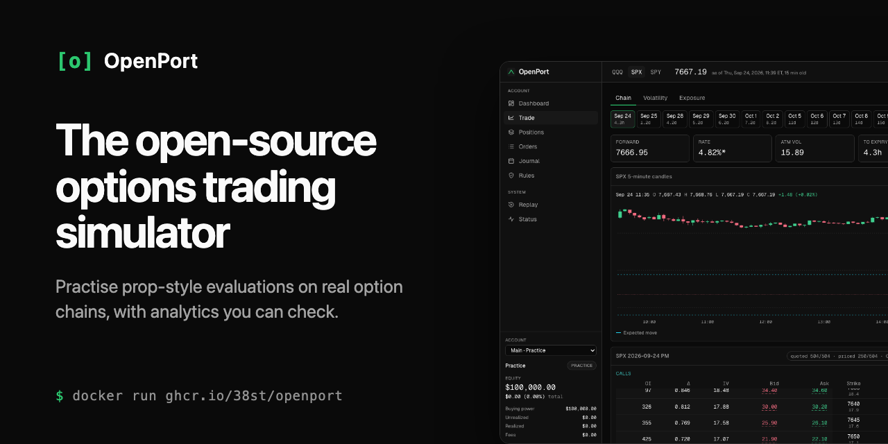
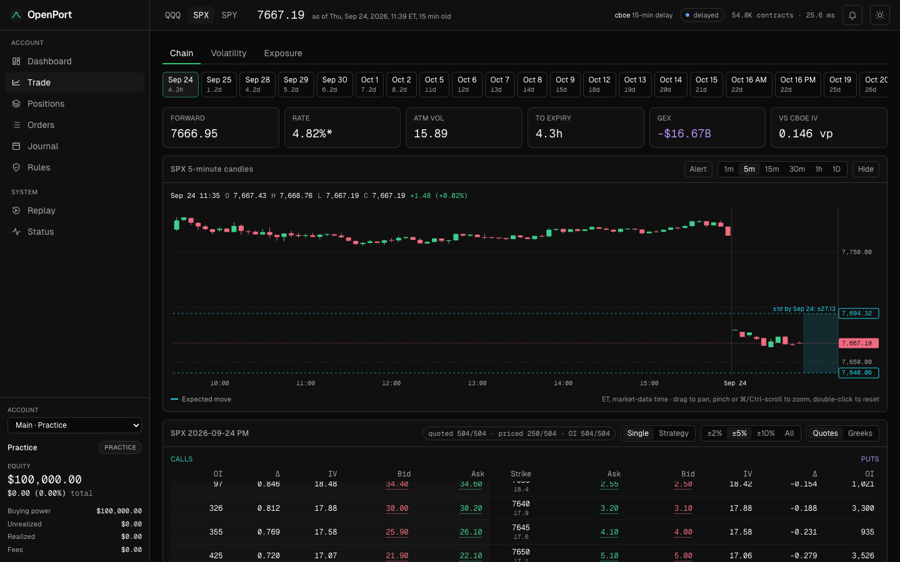
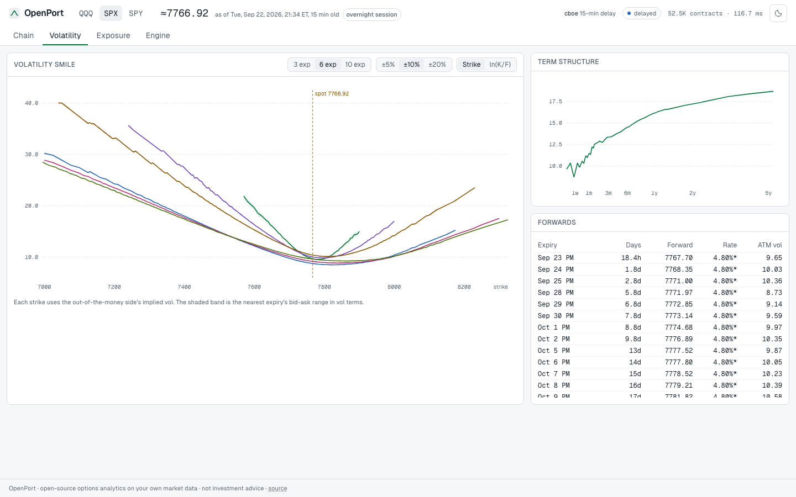
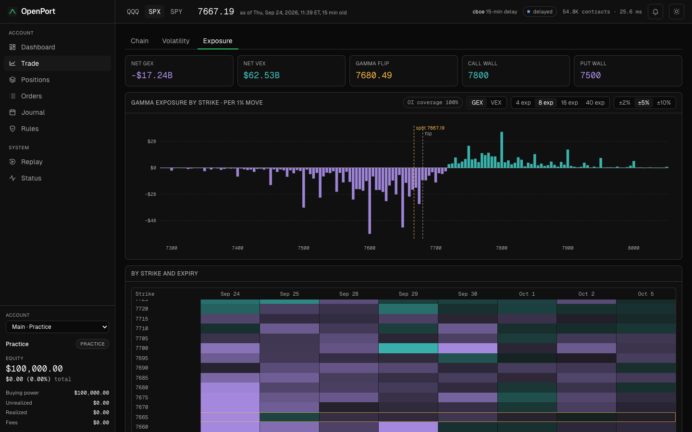
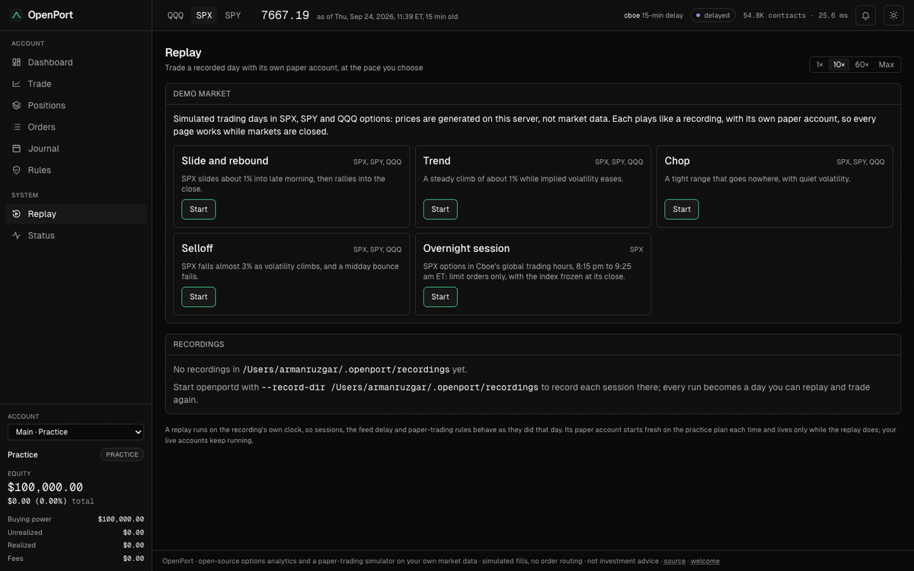

# OpenPort

[](https://github.com/38st/openport/actions/workflows/ci.yml)

[](https://openport.markets/)

Self-hosted options analytics and a trading simulator on your own market data. Plug in
the provider you already pay for, or start with Cboe's free delayed quotes, and get a
live web terminal: option chains with implied volatility and Greeks computed by OpenPort
itself, smiles and term structure, gamma and vanna exposure maps, and paper accounts
that trade those chains under prop-firm evaluation rules, with multi-leg strategies, a
chart of the underlying and replays of recorded days. Trade stock and ETF shares
for delta hedges, covered calls and collars, with buying-power and risk previews.

One C++20 binary runs the feed, the analytics engine, the simulator and the web
terminal. Your data and trades stay on your machine unless you enable external
notifications, which send the selected paper trading events to your channels.

**[Watch the demo on openport.markets](https://openport.markets/#demo)**: ten seconds
from the SPX chart to an order ticket on a simulated day. Or start it locally in one
command with the [quick start](#quick-start).



| Volatility (light theme) | Exposure |
| --- | --- |
|  |  |

## At a glance

- **One C++20 process** runs the feed, the analytics engine, the simulator and the web
  server; the terminal is React and TypeScript. [Architecture](docs/architecture.md).
- **Implied volatility** in about 0.4 µs and 5.4 Newton iterations per option, and a
  full analytics pass over the SPX chain (30,182 options, 63 expiries) in about 40 ms.
- **Within a few hundredths of a vol point** of Cboe's published IVs: median
  differences of 0.012 (SPX), 0.030 (QQQ) and 0.028 (SPY) out of the money.
- **A prop-firm-style simulator**: orders fill against the quotes the feed displays,
  under evaluation rules, with optional latency and simulated size impact, and a
  hash-chained journal that survives restarts.
- **1,640 C++, 964 web and 132 Python tests**, built in CI with GCC 13 on Ubuntu and
  Apple Clang on macOS, warnings as errors.

Timings are medians on an Apple M2 Max: the IV solve from `openport_bench`, and the SPX
pass (over 23 passes) and the Cboe comparison on live data during the session, all on
2026-09-24. [How the numbers are made](docs/methods.md).

No market open, or no data? The **demo market** plays simulated trading days you can
trade: twenty scenarios, including SPX, SPY, QQQ, XSP, NDX, RUT and VIX options,
from a reversal or a selloff to an afternoon waterfall, a pin into the close or a
position held overnight and over a weekend. Each run uses a fresh or repeatable seed,
with generated prices labelled as simulated on every page:



## What you get

- **Analytics**: the chain with bid/mid/ask IV, Greeks, volume and liquidity; SVI
  smiles and term structure; model-free IV, skew, realized volatility and IV rank;
  gamma and vanna exposure with the gamma flip and walls.
- **Evaluations**: daily loss bases, static or trailing floors, best-day and
  per-trade consistency, minimum days and trades, flat time, news and holding
  restrictions, instrument and opening-hour limits, and two-step evaluations.
  Custom plans add payout rules, scaling, reset costs and limits; funded plans
  stay hidden in the terminal unless already funded or explicitly enabled.
- **Orders and strategies**: up to four opening legs, rolls, trailing stops,
  stop-limits, OCO/OTO chains and brackets that protect partial remainders. Flatten
  works until flat: spreads close as one order and exits stay until the last contract
  is closed, with limit flatten overnight and in curb. EXTO/GTC_EXTO, timestamp GTD
  and conditions on another symbol, a study or the time of day support entries and exits.
- **Fills and fees**: displayed-size fills, optional Conservative latency and impact,
  inside fills, [walking limits](docs/paper-trading.md#walking-limits) and
  [itemized fees](docs/paper-trading.md#fees). These do not simulate queue position.
- **Margin and shares**: cash, IRA and margin accounts, strategy or portfolio margin,
  house requirements and optional IV shocks; share trades for hedges, covered calls
  and collars, with buying-power previews.
- **Risk**: held-book warnings, what-if adjustments, P&L profiles by date and IV,
  beta weighting to SPY/SPX, probability cones and a reduce-only kill switch.
- **Journal**: whole trades across rolls, entry/exit context, excursions, R-multiples,
  a P&L calendar and exports carrying attempt and replay-run identity.
- **Replay and playbooks**: multi-day runs, stepping, in-app verification and stress
  scenarios; versioned setups, joint backtests and live paper forward tests.
- **Scripting and alerts**: an OpenAPI contract, a Python client and an MCP server;
  account alerts in the terminal and to Discord, Telegram, ntfy or a webhook.

The [full feature list](docs/features.md) has every rule, order type and report.
On delayed data, a pass is practice, not proof of real-time performance.

## Quick start

On an Apple Silicon Mac, with Homebrew:

```bash
brew tap 38st/openport https://github.com/38st/openport
brew install openport
brew services start openport
```

Then open the `http://localhost:8080/#token=…` link in
`$(brew --prefix)/var/log/openport.log`.

Anywhere with Docker (Cboe delayed SPX, SPY, QQQ, IWM and DIA, no key needed):

```bash
docker run --rm --name openport -p 127.0.0.1:8080:8080 -v openport:/var/lib/openport ghcr.io/38st/openport
```

Then open the link it prints. The `openport` volume keeps your accounts and chart
history between runs, and when nothing is trading the terminal offers the demo market.
[docker-compose.yml](docker-compose.yml) runs the same image as a service.

From source (CMake 3.25+, a C++20 compiler, Boost 1.83+, OpenSSL 3, zlib, zstd and
Node 22+):

```bash
cmake -S . -B build -DCMAKE_BUILD_TYPE=Release
cmake --build build -j
(cd web && npm ci && npm run build)
./build/apps/openportd --symbols SPX,SPY,QQQ,IWM,DIA --web-root web/dist
```

[Installation](docs/install.md) covers your own provider, Compose, release archives,
recording and hosting a public demo.

## Providers

| Provider | `--provider` | Data | Key |
| --- | --- | --- | --- |
| Cboe delayed | `cboe` (default) | 15-minute delayed index and equity option chains | none |
| Databento | `databento` | Real-time OPRA quotes, trades and open interest | `DATABENTO_API_KEY` |
| Massive | `massive` | Real-time or delayed chain snapshots, by plan | `MASSIVE_API_KEY` |
| ThetaData | `thetadata` | Snapshots from your local Theta Terminal | Theta Terminal login |
| Tradier | `tradier` | Chain snapshots, real-time in production, delayed in its sandbox | `TRADIER_ACCESS_TOKEN` |
| tastytrade | `tastytrade` | DXLink quotes from a funded brokerage account | `TASTYTRADE_CLIENT_SECRET`, `TASTYTRADE_REFRESH_TOKEN` |
| Demo | `demo` | Simulated SPX, SPY, QQQ, XSP, NDX, RUT and VIX days | none |
| Replay | `replay` | A recording played back as the feed | none |

Every provider but Cboe, Demo and Replay is tested against sample responses and has
not yet been run live with a key; an [issue](https://github.com/38st/openport/issues)
saying how it went is welcome. The broker adapters read market data only.
[Configuration](docs/configuration.md) has each provider's details and every flag.

## Documentation

- [Features](docs/features.md): everything the terminal and simulator do
- [Installation](docs/install.md): Homebrew, Docker, Compose, source and public demos
- [Configuration](docs/configuration.md): providers, flags, update checks and security
- [Paper trading](docs/paper-trading.md): orders, fills, rules, the journal and reason codes
- [Playbooks](docs/playbooks.md): setups, staged orders, pass odds and batch backtests
- [How the numbers are made](docs/methods.md): forwards, IV, Greeks, exposure, accuracy
  and performance, with [volatility metrics](docs/volatility.md), [SVI](docs/svi.md)
  and [American analytics](docs/american-analytics.md)
- [API and scripting](docs/api.md): routes, the Python client and the MCP server
- [Architecture](docs/architecture.md), [runtime notes](docs/runtime.md),
  [scenarios](docs/scenarios.md) and [writing a provider adapter](docs/providers.md)

See [CONTRIBUTING.md](CONTRIBUTING.md) for development and pull requests, and
[SECURITY.md](SECURITY.md) to report a vulnerability privately.

## License

MIT. Not investment advice.
