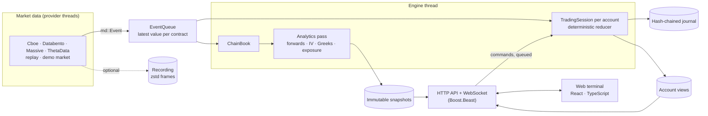

# Architecture

OpenPort is one C++20 process, `openportd`, that runs the market-data feed, the
analytics engine, the paper-trading simulator and the web server, plus a React
terminal it serves. This page is the map; the other documents hold the detail.

## The pieces

| Piece | Where | What it does |
| --- | --- | --- |
| Pricing | `src/pricing` | Black-76 and Black-Scholes-Merton with full Greeks, a safeguarded implied-volatility solver (Newton in log-price from a Corrado-Miller guess, bisection fallback), Cox-Ross-Rubinstein and Leisen-Reimer trees |
| Market data | `src/md`, `src/providers` | One event vocabulary (`md::Event`: definitions, quotes, trades, open interest, underlying prints, status) behind every provider adapter; contracts parsed from OSI symbols with their settlement and exercise conventions; product sessions and the holiday calendar; recording and replay |
| Queue | `md::EventQueue` | Keeps the latest value per contract while the engine is busy; definitions are ordering barriers and only trades may be dropped under overload |
| Analytics | `src/analytics` | Per expiry: a weighted put-call parity fit for the forward and discount factor, IVs and Greeks on that forward, de-Americanised IVs for equity options, SVI and SSVI surfaces with arbitrage checks, and dealer gamma and vanna exposure |
| Simulator | `src/trading` | `TradingSession`, a deterministic reducer per account: orders, fills against the displayed quotes, risk limits, buying power with spread-aware margin, evaluation rules, settlement, exercise and assignment, and P&L attribution by Greek |
| Journal | `trading/journal` | Every transaction as one SHA-256 hash-chained JSON line recording what changed; recovery replays and verifies the chain |
| Server | `src/server` | The engine thread, the JSON API and WebSocket ticks, paper accounts, one-minute candles, and the replay host that runs recorded days beside the live feed |
| Terminal | `web/` | React 19, TanStack Query and Tailwind, with its own SVG charts; no chart or UI library |

## Threads and data flow

- **Provider threads** publish events into the queue. Polling providers (Cboe, Massive,
  ThetaData) turn successive snapshots into only the changes; Databento streams.
- **One engine thread** owns all mutable state. It drains the queue into the chain
  book, recomputes analytics at most once a second for the underlyings whose data or
  rate curve changed, and publishes each result as an immutable snapshot behind a
  `shared_ptr`. HTTP handlers read snapshots and never block the feed.
- **Commands** from the terminal (orders, cancels, resets) are queued and applied on
  the engine thread, between market batches, so each account sees one ordered stream
  of market data and commands.
- **Each account's reducer** turns (state, input) into (state, events) with no clock of
  its own; the journal it appends to is passed in. Market time comes from the data, so
  a replay runs on its day's clock. The journal records each transaction's changes and
  a checkpoint of the whole state every thousand records.

## Design choices

- **Market time, not wall time.** Freshness, sessions, expiry and the trading date
  all run on the market data's clock, which is why the same code serves delayed
  feeds, live feeds, replays and the demo market.
- **Missing is not zero.** Quotes, open interest and Greeks that are absent stay
  absent, with coverage counts, rather than defaulting to zero.
- **Exact money.** Cash, fills and P&L are signed 64-bit micro-dollars; floating point
  is for analytics only.
- **Fail closed.** A stalled feed, a stale quote or a damaged journal refuses new
  orders instead of trading on bad data.

## Tests

462 GoogleTest cases cover pricing against reference values, the parity fit and SVI,
provider parsing, the queue, recording and replay, the simulator's rules, journal
recovery and tampering, the calendar and the HTTP API; 286 Vitest cases cover the
terminal. CI
builds with GCC 13 on Ubuntu and Apple Clang on macOS, both with warnings as errors,
and smoke-tests the Docker image.

## Further reading

- [How the numbers are made](../README.md#how-the-numbers-are-made)
- [Paper trading](paper-trading.md): orders, fills, rules, the journal and the API
- [Runtime](runtime.md): providers, sessions, recording and replay, the demo market
- [SVI](svi.md) and [American analytics](american-analytics.md)
