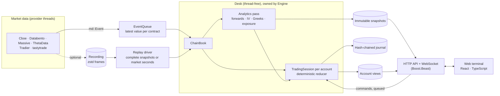

# Architecture

OpenPort is one C++20 process, `openportd`, that runs the market-data feed, the
analytics engine, the paper-trading simulator and the web server, plus a React
terminal it serves. This page is the map; the other documents hold the detail.


```mermaid
flowchart LR
  subgraph feed["Market data (provider threads)"]
    P["Cboe · Databento · Massive · ThetaData<br/>Tradier · tastytrade"]
  end
  P -- "md::Event" --> Q["EventQueue<br/>latest value per contract"]
  P -. "optional" .-> R[("Recording<br/>zstd frames")]
  R --> D["Replay driver<br/>complete snapshots or market seconds"]
  subgraph engine["Desk (thread-free), owned by Engine"]
    B["ChainBook"] --> A["Analytics pass<br/>forwards · IV · Greeks · exposure"]
    T["TradingSession per account<br/>deterministic reducer"]
  end
  Q --> B
  D --> B
  B --> T
  A --> T
  A --> S[("Immutable snapshots")]
  T --> J[("Hash-chained journal")]
  T --> V[("Account views")]
  S --> W["HTTP API + WebSocket<br/>(Boost.Beast)"]
  V --> W
  W <--> UI["Web terminal<br/>React · TypeScript"]
  W -- "commands, queued" --> T
```

## The pieces

| Piece | Where | What it does |
| --- | --- | --- |
| Pricing | `src/pricing` | Black-76 and Black-Scholes-Merton with full Greeks, a safeguarded implied-volatility solver (Newton in log-price from a Corrado-Miller guess, bisection fallback), Cox-Ross-Rubinstein and Leisen-Reimer trees |
| Market data | `src/md`, `src/providers` | One event vocabulary (`md::Event`: definitions, quotes, trades, session volume, open interest, underlying prints and official closes, complete snapshots, status) behind every provider adapter; contracts parsed from OSI symbols with their settlement and exercise conventions; product sessions and the holiday calendar; recording and replay |
| Queue | `md::EventQueue` | Keeps the latest value per contract while the engine is busy; definitions are ordering barriers and only trades may be dropped under overload |
| Analytics | `src/analytics` | Per expiry: a weighted put-call parity fit for the forward and discount factor, IVs and Greeks on that forward, de-Americanised IVs for equity options, SVI and SSVI surfaces with arbitrage checks, dealer gamma and vanna exposure, and lazy current volatility metrics |
| Simulator | `src/trading` | `TradingSession`, a deterministic reducer per account: orders, fills against displayed quotes with optional slippage, risk limits, buying power with strategy or portfolio margin, evaluation rules, settlement, exercise and assignment, and P&L attribution by Greek |
| Journal | `trading/journal` | Every transaction as one SHA-256 hash-chained JSON line recording what changed; recovery replays and verifies the chain |
| Desk | `src/server/desk.cpp` | Thread-free book, analytics, market-to-account glue, commands, circuit breakers, closing prints, dividends, account sessions and equity sampling |
| Server | `src/server` | The live and replay drivers, the JSON API and WebSocket ticks, paper accounts, persisted account-equity samples, one-minute candles, and the replay host that runs recorded days beside the live feed |
| Terminal | `web/` | React 19, TanStack Query and Tailwind, with its own SVG charts; no chart or UI library |

## Threads and data flow

- **Provider threads** publish events into the queue. Polling providers (Cboe, Massive,
  ThetaData, Tradier) turn successive snapshots into only the changes; Databento
  and tastytrade stream.
- **One live engine thread** owns a Desk and its mutable state. It drains the queue into the chain
  book, recomputes analytics at most once a second for the underlyings whose data or
  rate curve or cash-dividend schedule changed, and publishes each result as an
  immutable snapshot behind a `shared_ptr`. HTTP handlers read snapshots and never
  block the feed. It hands each underlying's known dividends to its American
  analytics as dates and dollar amounts, so the analytics and pricing layers do not
  depend on trading.
- **Volatility metrics** run lazily on API workers and a separate live-history
  worker, sharing the per-snapshot SVI cache. The history worker records at most one
  row per underlying per market minute in monthly CSVs. Replay/demo engines cannot
  write to that store. Pure analytics functions compute model-free IV, delta skew, realized
  volatility, cones and business-session moves. They do not run in the engine pass
  or change the trading reducer or journal. [Definitions](volatility.md).
- **Market-wide halts** belong to the Desk, shared by every account. The engine
  publishes the breaker reference, daily level and halt history under the status
  mutex for HTTP and WebSocket readers. With a paper journal, an atomic JSON file
  beside it preserves the state across restarts; the reducer's journal schema is
  unchanged. The terminal's banner follows the snapshot's market-time active flags.
- **API clients** use the checked OpenAPI contract. The Python client and MCP
  server call the same routes as the terminal. HTTP scope checks run before
  enqueueing; the authenticated actor travels with each command into the journal.
- **Commands** from the terminal (orders, cancels, resets) are queued and applied on
  the engine thread, between market batches, so each account sees one ordered stream
  of market data and commands.
- **Each account's reducer** turns (state, input) into (state, events) with no clock of
  its own; the journal it appends to is passed in. Market time comes from the data, so
  a replay runs on its day's clock. The journal records each transaction's changes and
  a checkpoint of the whole state every thousand records.

## Reproducible runs

`Desk` has no threads, event queue, wall clock or HTTP. Events retain their market
timestamps. Drivers supply drain boundaries, command times and the receipt clock
for feed-stall checks. Analytics can be computed by the Desk or supplied explicitly.
Equity samples can go to the existing store or an injected callback. Engine copies
its immutable publications under the reader mutex; HTTP never reads mutable Desk state.

The live driver keeps its 50 ms queue drain and latest-quote coalescing. Analytics
uses the existing steady-clock cadence and refreshes on each batch while accounts
hold positions or orders. This is the throughput-oriented path.

The replay driver bypasses that queue. `ReplayBatches` reads every selected event
in file order. Snapshot feeds drain at `SnapshotComplete`. Streams, including older
recordings without snapshot markers, drain at fixed integral market seconds. No
quotes or trades are discarded. Each batch waits for the Desk and its publications
before the driver proceeds. Analytics runs at most once per underlying per market
second, after that underlying's complete snapshot. Playback speed and fast-forward
change waits only. Snapshot boundaries remain atomic.

Each new run journals its source identity, SHA-256, session start, initial plan and
configuration, analytics settings, dividends and calendar overrides. Scenario
identity includes exact source bytes' hash, generator version, date and seed;
recording identity includes its absolute path, name, size and content hash. Boundary
records and commands carry explicit market and receipt clocks. These are ordinary
hash-chained `run_input` transactions; existing state schemas and older journals
still recover. A replay needs a fresh journal. Verification reproduces the recorded
prefix, including an intentionally stopped run, without starting Engine or HTTP.
It compares every transaction hash, final equity and the head hash.

The golden scenario trades a vertical, a bracket and a flatten. It asserts identical
journal bytes for repeated runs on one build/platform at different playback speeds,
and tests lockstep against continuous playback. Floating-point analytics and scenario
pricing use the platform math library, so journal hashes are not promised to match
between GCC/Linux and Apple Clang/macOS. The golden test also pins exact fill prices,
fees, quantities, times and final equity for CI on both platforms. Only Apple Clang
was available for this sandbox run. A changed generator or input is reported as an
input error, not silently treated as a different run.

## Design choices

- **Market time, not wall time.** Freshness, sessions, expiry and the trading date
  all run on the market data's clock, which is why the same code serves delayed
  feeds, live feeds, replays and the demo market.
- **Missing is not zero.** Absent quotes, session volume, open interest and Greeks
  stay absent, with coverage counts, rather than defaulting to zero.
- **Exact money.** Cash, fills and P&L are signed 64-bit micro-dollars; floating point
  is for analytics only.
- **Fail closed.** A stalled feed, a stale quote or a damaged journal refuses new
  orders instead of trading on bad data.

## Trading measurements

`openport_bench_trading` measures active `on_quotes` transactions and a fresh
`submit` after 10, 1,000 and 10,000 historical fills. Setup is outside the timed
loop. Quote measurements keep one resting order and do not grow history; submit
uses one iteration per seeded session, with three repetitions. No journal I/O is
timed. The scenario benchmark reads a generated SPX day, runs analytics and a flat
paper account, and reports market-hours simulated per wall-second.

Measured in this sandbox on 2026-09-27, Release/Apple Clang, Apple M2 Max MacBook Pro
(12 cores, 32 GB). Other validation jobs were running; these are local measurements,
not capacity claims. Times below are wall time; submit is the median of three.

| Historical fills | `on_quotes` | `submit` |
| --- | ---: | ---: |
| 10 | 16.3 µs | 2,353 µs |
| 1,000 | 855 µs | 1,215 µs |
| 10,000 | 3,751 µs | 5,209 µs |

The simulated SPX scenario ran 6.75 market hours in 1.88 wall seconds, or 3.59
market-hours per second. It has no orders or journal writes. Quote transaction
cost grew with history: the reducer copies its full state for each transaction,
including prior orders and fills. This task does not restructure that state.
Small submit timings also include valuation/risk work and do not grow monotonically.

```sh
./build/bench/openport_bench_trading --benchmark_min_time=0.1s
```

## Tests

759 GoogleTest cases cover pricing against reference values, the parity fit and SVI,
provider parsing, the queue, recording and replay, the simulator's rules, journal
recovery and tampering, the calendar and the HTTP API; 463 Vitest cases cover the
terminal, and 55 pytest cases the Python client and MCP server. CI builds with GCC 13
on Ubuntu and Apple Clang on macOS, both with warnings as errors, smoke-tests the
Docker image and validates its responses against the OpenAPI contract.

## Further reading

- [How the numbers are made](../README.md#how-the-numbers-are-made)
- [Paper trading](paper-trading.md): orders, fills, rules, the journal and the API
- [Runtime](runtime.md): providers, sessions, recording and replay, the demo market
- [SVI](svi.md), [American analytics](american-analytics.md) and [Volatility metrics](volatility.md)
