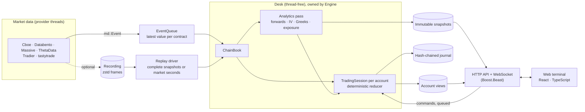

# Architecture

OpenPort is one C++20 process, `openportd`, that runs the market-data feed, the
analytics engine, the paper-trading simulator and the web server, plus a React
terminal it serves. This page is the map; the other documents hold the detail.


```mermaid
flowchart LR
  subgraph feed["Market data (provider threads)"]
    P["Cboe · Databento · Massive · ThetaData<br/>Tradier · tastytrade"]
  end
  P -- "md::Event" --> Q["EventQueue<br/>latest value per contract"]
  P -. "optional" .-> R[("Recording<br/>zstd frames")]
  R --> D["Replay driver<br/>complete snapshots or market seconds"]
  subgraph engine["Desk (thread-free), owned by Engine"]
    B["ChainBook"] --> A["Analytics pass<br/>forwards · IV · Greeks · exposure"]
    T["TradingSession per account<br/>deterministic reducer"]
  end
  Q --> B
  D --> B
  B --> T
  A --> T
  A --> S[("Immutable snapshots")]
  T --> J[("Hash-chained journal")]
  T --> V[("Account views")]
  S --> W["HTTP API + WebSocket<br/>(Boost.Beast)"]
  V --> W
  W <--> UI["Web terminal<br/>React · TypeScript"]
  W -- "commands, queued" --> T
```

## The pieces

| Piece | Where | What it does |
| --- | --- | --- |
| Pricing | `src/pricing` | Black-76 and Black-Scholes-Merton with full Greeks, a safeguarded implied-volatility solver (Newton in log-price from a Corrado-Miller guess, bisection fallback), Cox-Ross-Rubinstein and Leisen-Reimer trees |
| Market data | `src/md`, `src/providers` | One event vocabulary (`md::Event`: definitions, quotes, trades, session volume, open interest, underlying prints and official closes, complete snapshots, status) behind every provider adapter; contracts parsed from OSI symbols with their settlement and exercise conventions; product sessions and the holiday calendar; recording and replay |
| Queue | `md::EventQueue` | Keeps the latest value per contract while the engine is busy; definitions are ordering barriers and only trades may be dropped under overload |
| Analytics | `src/analytics` | Per expiry: a weighted put-call parity fit for the forward and discount factor, IVs and Greeks on that forward, de-Americanised IVs for equity options, SVI and SSVI surfaces with arbitrage checks, dealer gamma and vanna exposure, and lazy current volatility metrics |
| Simulator | `src/trading` | `TradingSession`, a deterministic reducer per account: orders, fills against supplied quotes with optional latency, simulated size impact and slippage, risk limits, buying power with strategy or portfolio margin, evaluation rules, settlement, exercise and assignment, and P&L attribution by Greek |
| Journal | `trading/journal` | Every transaction as one SHA-256 hash-chained JSON line recording what changed; recovery replays and verifies the chain |
| Desk | `src/server/desk.cpp` | Thread-free book, analytics, market-to-account glue, commands, circuit breakers, closing prints, dividends, account sessions and equity sampling |
| Server | `src/server` | The live and replay drivers, the JSON API and WebSocket ticks, paper accounts, persisted account-equity samples, one-minute candles, and the replay host that runs recorded days beside the live feed |
| Terminal | `web/` | React 19, TanStack Query and Tailwind, with its own SVG charts; no chart or UI library |

## Threads and data flow

- **Provider threads** publish events into the queue. Polling providers (Cboe, Massive,
  ThetaData, Tradier) turn successive snapshots into only the changes; Databento
  and tastytrade stream.
- **One live engine thread** owns a Desk and its mutable state. It drains the queue into the chain
  book, recomputes analytics at most once a second for the underlyings whose data or
  rate curve or cash-dividend schedule changed, and publishes each result as an
  immutable snapshot behind a `shared_ptr`. HTTP handlers read snapshots and never
  block the feed. It hands each underlying's known dividends to its American
  analytics as dates and dollar amounts, so the analytics and pricing layers do not
  depend on trading.
- **Volatility metrics** run lazily on API workers and a separate live-history
  worker, sharing the per-snapshot SVI cache. The history worker records at most one
  row per underlying per market minute in monthly CSVs. Replay/demo engines cannot
  write to that store. Pure analytics functions compute model-free IV, delta skew, realized
  volatility, cones and business-session moves. Enabled playbook volatility conditions
  also read these metrics on the Desk thread; they do not change the trading reducer. [Definitions](volatility.md).
- **Market-wide halts** belong to the Desk, shared by every account. The engine
  publishes the breaker reference, daily level and halt history under the status
  mutex for HTTP and WebSocket readers. With a paper journal, an atomic JSON file
  beside it preserves the state across restarts; the reducer's journal schema is
  unchanged. The terminal's banner follows the snapshot's market-time active flags.
- **API clients** use the checked OpenAPI contract. The Python client and MCP
  server call the same routes as the terminal. HTTP scope checks run before
  enqueueing; the authenticated actor travels with each command into the journal.
- **Visitor sandboxes** are ordinary Desk accounts on the demo feed with ephemeral
  scoped credentials. A mutex protects capacity reservations and rate limits.
  Expiry uses a separate injectable monotonic clock; the engine thread deletes
  expired accounts and files. HTTP and WebSocket account visibility follows the
  authenticated identity. No new reducer state or journal fields are required.
- **External notifications** observe live account publications and feed health.
  A bounded queue hands selected events to one HTTP worker; retries and rate limits
  use its own clock. Replay engines never attach the observer. No notification
  configuration, credentials or delivery state enters the trading journal.
- **Commands** from the terminal (orders, cancels, resets) are queued and applied on
  the engine thread, between market batches, so each account sees one ordered stream
  of market data and commands.
- **Each account's reducer** turns (state, input) into (state, events) with no clock of
  its own; the journal it appends to is passed in. Market time comes from the data, so
  a replay runs on its day's clock. A transaction works on a copy of the account and
  commits it whole or not at all; the copy shares the account's history, so it costs
  the open positions and working orders, not the past ([measurements](#trading-measurements)).
  The journal records each transaction's changes and a checkpoint of the whole state
  every thousand records.

## Playbooks

The Desk owns the versioned definition catalogue and each account's transient
stages. `playbooks.json` is separate from the reducer journal. Evaluation runs when
the analytics update; preview is read-only, and sends use the normal queued command path.
A single C++ template picker serves the terminal and playbooks. Auto entries and
time stops require a replay Desk. Immutable publications carry account stages to
HTTP readers. Replay provenance includes definitions and edits for verification
and archived adherence reports. [Playbook contract](playbooks.md).

The trading evaluation functions are shared by the reducer and the historical
pass-odds bootstrap. The bootstrap owns its explicit seed and never changes account
state or supplies a wall clock to the reducer.

## Batch backtests

`server/backtest.cpp` drives the same Desk and ReplayBatches without Engine or
HTTP. A bounded pool runs fresh daily accounts. A second, ordered pass carries an
account across input files until its evaluation passes or fails. Source transitions
clear file-local instrument IDs and analytics while preserving account and candle
history; they enter run provenance for verification. Reports retain input order,
exact-money results and relative journal names, with no wall-clock measurements.
`BacktestHost` owns one cancellable job and persists reports beside the paper
journal. [Inputs, attempt rules and limitations](playbooks.md#batch-backtests).

## Reproducible runs

`Desk` has no threads, event queue, wall clock or HTTP. Events retain their market
timestamps. Drivers supply drain boundaries, command times and the receipt clock
for feed-stall checks. Analytics can be computed by the Desk or supplied explicitly.
Equity samples can go to the existing store or an injected callback. Engine copies
its immutable publications under the reader mutex; HTTP never reads mutable Desk state.

The live driver keeps its 50 ms queue drain and latest-quote coalescing. Analytics
uses the existing steady-clock cadence and refreshes on each batch while accounts
hold positions or orders. This is the throughput-oriented path.

The replay driver bypasses that queue, and so does the demo market's live feed, which
plays each generated day through it. `ReplayBatches` reads every selected event in
file order. Snapshot feeds drain at `SnapshotComplete`, and consecutive snapshots of
one market time (a recording holds one per underlying, QQQ, SPX then SPY in the demo
market's) form one batch: a snapshot joins the batch when its `SnapshotComplete`
names the same time and none of its events is later. So every underlying's quotes
for that time are in place before any trigger, fill, plan rule, playbook or equity
sample runs. Streams, including older recordings without snapshot markers, drain at
fixed integral market seconds. No quotes or trades are discarded: a truncated
recording delivers every complete snapshot before it fails. Each batch waits for the
Desk and its publications before the driver proceeds. Analytics runs at most once per
underlying per market second, after that underlying's complete snapshot. Playback
speed and fast-forward change waits only. Snapshot boundaries remain atomic.

Each new run journals its source identity, SHA-256, session start, initial plan and
configuration, analytics settings, dividends and calendar overrides. Scenario
identity includes exact source bytes' hash, generator version and output revision,
date and seed;
recording identity includes its absolute path, name, size and content hash. Boundary
records and commands carry explicit market and receipt clocks. These are ordinary
hash-chained `run_input` transactions; existing state schemas and older journals
still recover. A replay needs a fresh journal. Verification reproduces the recorded
prefix, including an intentionally stopped run, without starting Engine or HTTP.
It compares every transaction hash, final equity and the head hash.

Driver 5 adds AM settlement on the expiry date’s first underlying print at or after
09:30 ET, with its provenance. Drivers 1–4 keep manual AM settlement during
verification. The start input records `"driver": 5`: batches of whole market instants, with each
underlying's quotes offered at the market time its own snapshot arrived; a new
trading date's first batch rolling each account over on the finished day's closing
marks before that batch's quotes; and each command's input recorded before the
transactions it causes. That record is made at the account's own time, so it moves
no clock and runs no time rule ahead of the command's quotes, and a journal a crash
cuts off after it still says what the command was. A batch's boundary input still
follows the batch's transactions, since it advances the account's clock. A run
recorded with `"driver": 3` recorded command inputs after their transactions; one
with `"driver": 2` also rolled over after the new day's quotes; one recorded without
a driver batched each snapshot alone and offered every current quote at the latest
market time. Each verifies with the driver it was made with, so its fills and hashes
reproduce exactly.

Replay, drill and scenario journals write each line at once but sync it to disk at
most every 250 ms, and at pause, stop, finish and teardown, so a kept run is synced
before it is listed or opened. A process crash loses nothing written; a power cut can
lose the last quarter second. Live paper accounts sync every record before its
transaction is published. The journal bytes are the same either way.

The golden scenario trades a vertical, a bracket and a flatten. It asserts identical
journal bytes for repeated runs on one build/platform at different playback speeds,
and tests lockstep against continuous playback. Floating-point analytics and scenario
pricing use the platform math library, so journal hashes are not promised to match
between GCC/Linux and Apple Clang/macOS. The golden test also pins exact fill prices,
fees, quantities, times and final equity for CI on both platforms. Only Apple Clang
was available for this sandbox run. A changed generator or input is reported as an
input error, not silently treated as a different run.

## Design choices

- **Market time, not wall time.** Freshness, sessions, expiry and the trading date
  all run on the market data's clock, which is why the same code serves delayed
  feeds, live feeds, replays and the demo market.
- **Missing is not zero.** Absent quotes, session volume, open interest and Greeks
  stay absent, with coverage counts, rather than defaulting to zero.
- **Exact money.** Cash, fills and P&L are signed 64-bit micro-dollars; floating point
  is for analytics only.
- **Fail closed.** A stalled feed, a stale quote or a damaged journal refuses new
  orders instead of trading on bad data.

## Trading measurements

A transaction applies a command or a market batch to a copy of the account and
commits the copy whole or not at all, so what it costs is the copy and the rules it
runs. None of that reads the account's history:

- **Shared history.** Orders, fills, closures, reviews, notes and the contract, book
  and valuation maps use persistent trees: a 32-way radix tree for vectors and a
  balanced B+ tree for maps and sets. A copy shares one root; a write copies the
  path to its chunk, with O(log n) pointer copies. Erases may also copy a neighbour
  to rebalance a map. Snapshots for readers share the same subtrees.
- **Working orders.** Scans for open orders read an index of them, rebuilt at each
  commit from the orders open before and those placed since (a closed order never
  reopens); duplicate and retried client order IDs look up an index of first uses.
- **Rules read positions.** Loss, floor and exposure checks compute equity, risk and
  buying power from the positions and working orders, not from a full snapshot.
- **Reviews.** Trade and strategy reviews are sampled from lifecycles kept current as
  fills and closures arrive, not rebuilt from every fill; a finished trade's lifecycle
  is dropped once no review can change.
- **Journal changes.** A record's change from the record before is found field by
  field, skipping shared subtrees instead of walking every chunk or writing out and
  comparing both states. The records are byte for byte what comparing whole states
  gives; a checkpoint still writes the whole state every thousand records.

The rules also ask the calendar many times a batch, for each position's session and
expiry; the scenario grid asks once per position, not once per cell. A date's holiday, business day and close,
and for each kind of root the sessions around a New York date, are worked out once per
thread and remembered, so a session lookup takes about 135 ns instead of 10 µs. Each
thread keeps its own memo, so reading takes no lock; a thread that finds a newly
published holiday schedule empties its memo before it answers.

`OPENPORT_VERIFY_REVIEWS=1` and `OPENPORT_VERIFY_JOURNAL=1` make the reducer check each
review update and each record's change against a rebuild from every fill and a
comparison of both states, and throw on any difference; CI runs the whole suite with
both. `TradingScaling.QuoteBatchesCostTheOpenBookNotTheHistory` keeps a quote batch
after 10,000 fills within four times one after 10, flat and holding a position.

`openport_bench_trading` measures quote batches and a fresh `submit` after 10, 1,000
and 10,000 historical fills (alternating one-lot market orders), and quote batches
again holding one contract, whose trade review samples each batch. A resting bid
inside the price band keeps every batch on the full transaction path. Setup is outside
the timed loop and no journal I/O is timed; submit is the median of three.

Measured on 2026-09-27, Release/Apple Clang, Apple M2 Max MacBook Pro (12 cores,
32 GB), as CPU time: other work kept the machine busy, so wall time is not reported.
Each change was measured against the build before it, run alongside. The shared
history:

| Historical fills | Quote batch, before | After | Holding, before | After | `submit`, before | After |
| --- | ---: | ---: | ---: | ---: | ---: | ---: |
| 10 | 113 µs | 77 µs | 2,693 µs | 529 µs | 2,670 µs | 559 µs |
| 1,000 | 1,109 µs | 79 µs | 5,049 µs | 528 µs | 5,494 µs | 573 µs |
| 10,000 | 10,103 µs | 79 µs | 26,629 µs | 530 µs | 32,971 µs | 577 µs |

The calendar memo, as the fastest of five interleaved runs, since noise only adds time:

| Historical fills | Quote batch, before | After | Holding, before | After | `submit`, before | After |
| --- | ---: | ---: | ---: | ---: | ---: | ---: |
| 10 | 64 µs | 8 µs | 453 µs | 23 µs | 447 µs | 30 µs |
| 1,000 | 64 µs | 8 µs | 441 µs | 24 µs | 461 µs | 34 µs |
| 10,000 | 65 µs | 8 µs | 438 µs | 24 µs | 474 µs | 43 µs |

With a live paper journal, each record costs its disk sync plus about 1% for finding
the change; before, writing out and comparing the whole state took most of the time
and grew with the history. A replay journal shares one sync among the records of each
250 ms. Appending an order, a fill and a client order ID copies a tree path, O(log n)
pointers, not a list of every chunk: in a loop of submits after 100,000 fills, a submit
took about 95 µs of wall time with the trees and 250 µs with flat chunk lists, on the
busy machine above. Asking once per position instead of once per grid cell took
about a sixth more off a held position's batch.

A simulated SPX replay with analytics and a flat account, writing 906 journal records,
took a median 11.8 s of wall time syncing every record and 2.6 s batched, in three
interleaved runs each on the busy machine above; its syncs fell from 906 to 8–19.

The scenario benchmark reads a generated SPX day, runs analytics and a flat paper
account, and reports market-hours simulated per wall-second: 6.75 market hours in 1.88
wall seconds (3.59 per second) when measured earlier the same day, before both
changes; it has no orders or journal writes.

```sh
./build/bench/openport_bench_trading --benchmark_min_time=0.1s
```

## Tests

905 GoogleTest cases cover pricing against reference values, the parity fit and SVI,
provider parsing, the queue, recording and replay, the simulator's rules, journal
recovery and tampering, the calendar and the HTTP API; 556 Vitest cases cover the
terminal, and 56 pytest cases the Python client and MCP server. CI builds with GCC 13
on Ubuntu and Apple Clang on macOS, both with warnings as errors, smoke-tests the
Docker image and validates its responses against the OpenAPI contract.

## Further reading

- [How the numbers are made](methods.md)
- [Paper trading](paper-trading.md): orders, fills, rules, the journal and the API
- [Runtime](runtime.md): providers, sessions, recording and replay, the demo market
- [SVI](svi.md), [American analytics](american-analytics.md) and [Volatility metrics](volatility.md)
